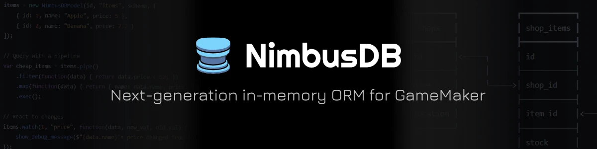

## What's NimbusDB?

**NimbusDB** is an in-memory, ORM-style database engine and reactive query system for GameMaker 2.3+. It combines relational concepts (models, schemas, relations, joins), an ORM-like CRUD and pipeline API, and a reactivity layer (`Computed`, `Watcher`, `Derived`), all running entirely in memory inside your GameMaker project.

If you're coming from TypeScript/Node tools like Prisma, TypeORM, or Redis OM, many of NimbusDB's concepts will feel familiar, just adapted for GML and GameMaker's single-threaded runtime.

## Why NimbusDB?

Managing structured data in GameMaker usually means juggling DS structures, arrays of structs, and a lot of manual bookkeeping for relationships and updates. **NimbusDB** wraps all of that into a single, consistent API: define your data once as a model, query it with a fluent API or pipelines, and let reactivity handle keeping your game state in sync.

Whether you're building a simple save system or a complex game with many interconnected entities, NimbusDB gives you the tools to manage your data without reinventing the wheel each time.

## How it Works

NimbusDB is built around three interacting layers:

### Models & Catalogs

A **Model** represents a single collection of records, similar to a table, with an optional **Schema** that defines column types, constraints (`PRIMARY_KEY`, `UNIQUE`, `OPTIONAL`), validators, and default values. Models can also be schemaless if you want full flexibility.

Multiple models can be grouped into a **Catalog**, which manages relations between models, since relations defined directly on a model are "blind", while catalog-level relations are aware of both sides.

### Pipelines

Beyond simple `.get()` and `.find()` queries, NimbusDB provides **Pipelines**, chainable, lazy data transformation workflows. You can filter, map, sort, join, and aggregate data, with operations only executing when you call `.exec()` or `.get()`. Pipelines also support cursor-based step control, letting you re-run, skip, or overwrite steps as needed.

### Reactivity

The reactivity layer is what sets NimbusDB apart from typical database libraries. `Computed` values recompute automatically when their source data changes, `Watcher`s run custom logic whenever specific columns update, and `Derived` values keep instance or global variables in sync with model data, no manual refresh logic required.

For a deeper dive into how these layers fit together, see [Architecture](/concepts/architecture).

## Limitations

1. **Client-Side Only**

	**NimbusDB** is designed to run entirely on the client side, which means it does not support server-side operations (yet). Primarily, all data is stored in memory and will be lost when the game is closed, though it can be exported and imported using various formats.

2. **Safety**

	**NimbusDB** currently only uses basic safety measures, such as input validation, error handling, and simple encryption. It does not implement advanced security features like authentication or access control, so it is not recommended for storing sensitive data, such as player information or game progress. Always ensure that you have proper backups of your data and consider using additional security measures if necessary.

3. **No Test For GameMaker <2.3**

	**NimbusDB** is built specifically for GameMaker 2.3 and later versions, and it may not be compatible with older versions of GameMaker.

---

Ready to get started? Head over to [Setup](/getting-started/setup) to install NimbusDB in your project. 

Have questions or feedback? Join the [Discord server](https://discord.gg/UsqbHSN23h) or [GitHub Discussions](https://github.com/undervolta/NimbusDB/discussions).
