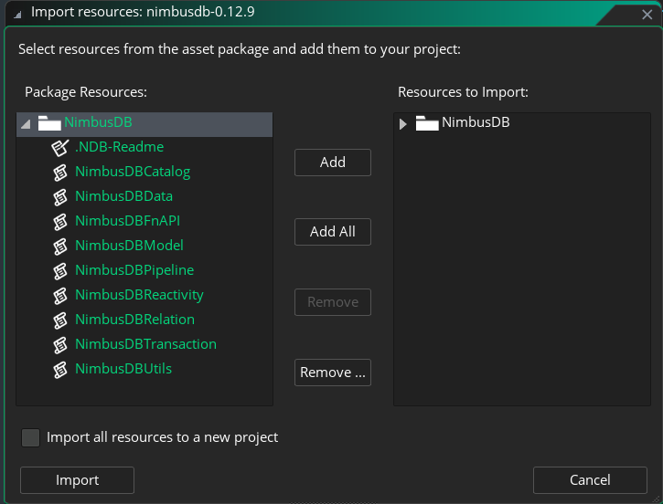
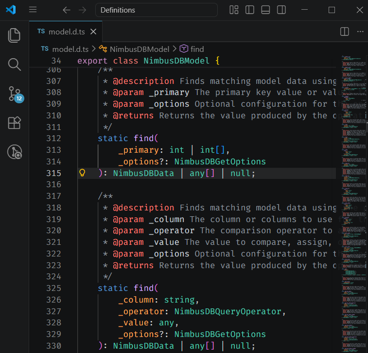
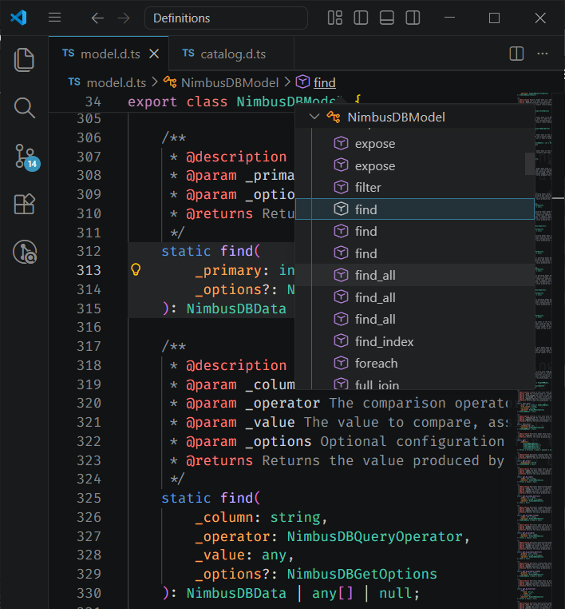
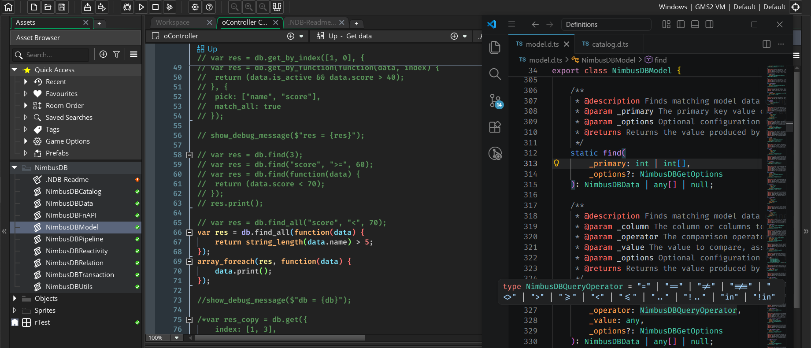

## Requirements

To use **NimbusDB**, you need to have the following:

### Game Engine

| Name | Version | Supported | 
| ---- | ---- | ---- |
| GameMaker | 2.3+ | ✅ |

#### GameMaker

Here's a list of the tested versions of GameMaker that are compatible with **NimbusDB**:

| Platform    | IDE            | Runtime        | Notes |
|-------------|----------------|----------------|-------|
| Windows VM  | v2026.0._x_._y_ | v2026.0._x_._y_ | Any version of _x_ and _y_, **tested and working** |
| Windows VM  | v2024.14._x_._y_ | v2024.14._x_._y_ | Any version of _x_ and _y_, **tested and working** |
| Windows YYC | v2024.14._x_._y_ | v2024.14._x_._y_ | Any version of _x_ and _y_, **tested and working** |
| HTML5       | v2024.14._x_._y_ | v2024.14._x_._y_ | Not tested |

It should work on any version of GameMaker 2.3 or later, but the above versions are the ones that have been tested and confirmed to be working.

## Installation

There's 2 way to install/update **NimbusDB** to your project:

### Via GameMaker's Local Package Manager

This is the recommended way to install **NimbusDB**, as it allows you to easily update to the latest version when a new release is available.

1. Download the latest release of **NimbusDB** from the [GitHub releases page](https://github.com/undervolta/NimbusDB/releases).
2. Extract the downloaded ZIP file and locate the `NimbusDB-v<VERSION>` folder.
3. Open your GameMaker project and go to `Tools` > `Import Local Package`.
4. Select the `NimbusDB-v<VERSION>.yymps` file from the extracted folder and click `Open`.
5. Select the `NimbusDB` package from the list and click `Add All`.
    
6. Click `Import` to import the package into your project. 

:::tip
- You can drag and drop the `NimbusDB-v<VERSION>.yymps` file into the GameMaker IDE to import it as well.
- You can exclude the `NimbusDBFnAPI` script asset if you don't need a function-based API for **NimbusDB**. So, for OOP users, you're recommended to exclude the `NimbusDBFnAPI` script asset.
:::

### Manual Copy

1. Download the latest release of **NimbusDB** from the [GitHub releases page](https://github.com/undervolta/NimbusDB/releases).
2. Extract the downloaded ZIP file and locate the `NimbusDB-v<VERSION>/Scripts` folder.
3. Open your GameMaker project.
4. Create your own script assets in your project and copy the code from the `Scripts` folder of the extracted NimbusDB release into your own scripts.
5. Make sure to copy all the scripts and maintain the same script names as in the NimbusDB release.

## Definition Files (Optional)

**NimbusDB** package comes with TypeScript definition files (`.d.ts`) that provide type information for the NimbusDB API. These files are useful for code editors that support TypeScript.

You can use these definition files in your secondary code editor to get better development experience when working with **NimbusDB**, even if GameMaker doesn't support TypeScript. Here's how you can set it up:

1. Locate `NimbusDB-v<VERSION>/Definitions` folder in the extracted **NimbusDB** release.
2. Open those files (or the entire folder) in your code editor (e.g., [Visual Studio Code](https://code.visualstudio.com/)).
3. You're set! You can use the type information from the definition files to get type checking for **NimbusDB** in your code editor.

| JSDoc is included for each function/method | Breadcrumb to navigate to the function |
| --- | --- |
|  |  |

:::note
Think of the definition files as a simple offline documentation for the NimbusDB API that your code editor can understand. They don't affect your GameMaker project directly, but they enhance your coding experience by providing type information for **NimbusDB** functions and classes.
:::
