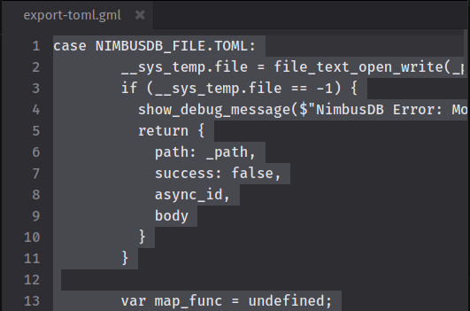
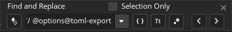
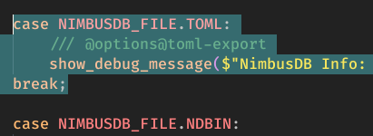

import { Tabs, TabItem, Badge } from '@astrojs/starlight/components';
import "../../../styles/custom.css";
import Tooltip from '../../../components/Tooltip.astro';

In this section, we'll learn how to export your **NimbusDB** models to various file formats. We'll use this `items` model as an example:

<Tabs syncKey='lang'>
    <TabItem label="GML" value="gml">
    ```ts
    var schema = {
        id: {
            type: NIMBUSDB_DATA_TYPE.INTEGER,
            const: NIMBUSDB_CONSTRAINT.PRIMARY_KEY
        },
        name: NIMBUSDB_DATA_TYPE.STRING,
        price: {
            type: NIMBUSDB_DATA_TYPE.NUMBER,
            validator: function(data, value) {
                return value >= 0;
            },
            default_value: 0
        },
        is_locked: {
            type: NIMBUSDB_DATA_TYPE.BOOLEAN,
            const: NIMBUSDB_CONSTRAINT.OPTIONAL,
            default_value: false
        }
    };

    items = new NimbusDBModel(id, "items", schema, [
        { id: 1, name: "Apple", price: 5 },
        { id: 2, name: "Banana", price: 7.2 },
        { id: 3, name: "Cherry", price: 15 },
        { id: 4, name: "Date", price: 12.5 },
        { id: 5, name: "Elderberry", price: 8 },
        { id: 6, name: "Fig", price: 10 },
        { id: 7, name: "Grape", price: 6 },
        { id: 8, name: "Honeydew", price: 9 },
        { id: 9, name: "Kiwi", price: 4 },
        { id: 10, name: "Lemon", price: 3 }
    ]);
    ```
    </TabItem>
</Tabs>

But first, let's take a look at the available file formats and their behaviors.

## File Formats

| Export Feature | CSV | JSON | JSONL | YAML | TOML | NDBIN | Custom |
| --- | --- | --- | --- | --- | --- | --- | --- |
| **Available** | Yes | Yes | Yes | Yes | <Tooltip text="You need to activate it first">[Optional](#enable-toml-export)</Tooltip> | Yes | Yes |
| **Data Export** | Yes | Yes | Yes | Yes | Yes | Yes | <Tooltip text="If implemented in the writer function" align="right">Yes</Tooltip> |
| **Metadata Export** | No | <Tooltip text="Optional">Yes</Tooltip> | No | <Tooltip text="Optional">Yes</Tooltip> | <Tooltip text="Optional">Yes</Tooltip> | Yes | <Tooltip text="If implemented in the writer function" align="right">Yes</Tooltip> |
| **Model Export** | No | <Tooltip text="Optional">Yes</Tooltip> | No | <Tooltip text="Optional">Yes</Tooltip> | <Tooltip text="Optional">Yes</Tooltip> | Yes | <Tooltip text="If implemented in the writer function" align="right">Yes</Tooltip> |
| **Enum Export** | No | <Tooltip text="Optional">Yes</Tooltip> | No | <Tooltip text="Optional">Yes</Tooltip> | <Tooltip text="Optional">Yes</Tooltip> | Yes | <Tooltip text="If implemented in the writer function" align="right">Yes</Tooltip> |
| **Include Custom Data** | No | <Tooltip text="Optional">Yes</Tooltip> | No | <Tooltip text="Optional">Yes</Tooltip> | <Tooltip text="Optional">Yes</Tooltip> | Yes | <Tooltip text="If implemented in the writer function" align="right">Yes</Tooltip> |
| **Asynchronous** | No | No | No | No | No | Optional | No |
| **File Extension** | `.csv` | `.json` | `.jsonl`, `.ndjson` | `.yaml`, `.yml` | `.toml` | `.ndbin` | Any |

| Import Feature | CSV | JSON | JSONL | YAML | TOML | NDBIN | Custom |
| --- | --- | --- | --- | --- | --- | --- | --- |
| **Available** | Yes | Yes | Yes | No | No | Yes | <Tooltip text="If implemented in the reader function" align="right">Yes</Tooltip> |
| **Data Import** | Yes | Yes | Yes | No | No | Yes | <Tooltip text="If implemented in the reader function" align="right">Yes</Tooltip> |
| **Model Import** | No | <Tooltip text="Optional">Yes</Tooltip> | No | No | No | Yes | <Tooltip text="If implemented in the reader function" align="right">Yes</Tooltip> |
| **Asynchronous** | No | No | No | No | No | Optional | No |
| **File Extension** | `.csv` | `.json` | `.jsonl`, `.ndjson` | N/A | N/A | `.ndbin` | Any |

## Exporting Model Data

Use the `export()` method to export your model data to a file. If you don't specify the file extension, **NimbusDB** will automatically detect the file format based on the file name.

<Tabs>
    <TabItem label="GML" value="gml">
    ```ts {1, 5, 10, 15} ".csv" ".json" "type:" "~/" ".mydat" "type: NIMBUSDB_FILE.JSON"
    // (1) auto-detect the file format
    items.export("items.csv");      // will be exported as CSV
    items.export("items.json");     // will be exported as JSON

    // (2) specify the file format/extension
    items.export("items.yaml", {
        type: NIMBUSDB_FILE.YAML    // or `extension: NIMBUSDB_FILE.YAML`
    });

    // (3) use the game path as the root directory
    items.export("~/items.csv", {       // the path will be resolved to "working_directory/items.csv"
        // options for the export...     // `working_directory` is your game path
    });

    // (4) file extension obfuscation
    // this allows you to export files to certain formats 
    // without revealing the actual file type through the extension
    items.export("items.mydat", {       // a `.mydat` custom file extension
        type: NIMBUSDB_FILE.JSON        // but the content will still be a JSON
    });
    ```
    </TabItem>
</Tabs>

### CSV Export

The CSV export feature allows you to export your model data to a CSV file, a comma-separated values format that can be easily opened and edited in spreadsheet software.

<Tabs>
    <TabItem label="GML" value="gml">
    ```ts {1, 13, 19}
    // (1) basic usage
    items.export("items.csv");          // using auto-detect file format

    items.export("items.someext", {     // specify the file format/extension
        type: NIMBUSDB_FILE.CSV
    });

    items.export_csv("items.csv");      // using the csv export method

    // (2) export options
    // all options are usable for both `export()` and `export_csv()`

    // (2.1) custom delimiter
    items.export_csv("items.csv", {
        delimiter: "; ",                // now "; " is used as the outer delimiter (that used for splitting the data)
        inner_delimiter: ","            // and "," is used as the inner delimiter
    });

    // (2.2) custom headers / column order
    items.export_csv("items.csv", {
        headers: ["id", "name", "price"]    // specify the column order
    });
    ```
    </TabItem>
</Tabs>

:::note
CSV export only includes the data, and doesn't support exporting the model definition or metadata. If you want to include them in the export, consider using the JSON, YAML, or TOML formats instead.
:::

:::tip
CSV export in **NimbusDB** is not like other CSV libraries that only support primitive values. It supports exporting complex data types like arrays, objects, even nested structures of them.
:::

### JSON Export

The JSON export is the safest and most versatile export format, which can be used anywhere.

<Tabs>
    <TabItem label="GML" value="gml">
    ```ts {1, 13, 18, 23, 31}
    // (1) basic usage
    items.export("items.json");         // using auto-detect file format

    items.export("items.someext", {     // specify the file format/extension
        type: NIMBUSDB_FILE.JSON
    });

    items.export_json("items.json");    // using the json export method

    // (2) export options
    // all options are usable for both `export()` and `export_json()`

    // (2.1) compact mode
    items.export_json("items.json", {
        compact: true                   // only export the data in array of objects format
    });

    // (2.2) pretty print
    items.export_json("items.json", {
        pretty: true
    });

    // (2.3) map the data before exporting
    items.export_json("items.json", {
        map: function(data) {
            data.price -= 2;            // reduce all data's price by 2
            return data;
        }
    });

    // (2.4) cherry-pick the exported content
    items.export_json("items.json", {
        include: {
            metadata: ["exported_at", "lib_version"],           // export only "exported_at" and "lib_version" metadata
            stats: "all",                                       // export all model's stats
            model: ["data", "name", "primary_key", "schema"],   // export only model's "data", "name", "primary_key", and "schema"

            // you can also export your own custom data
            hello: "world",
            num: 123,
            arr: [1, 2, 3]
        }
    });
    ```
    </TabItem>
</Tabs>

:::tip
JSON export supports exporting the model definition and metadata along with the data, but it's optional. You can choose to only export the data if you don't need the extra information, or if you want to keep the file size smaller.
:::

### JSONL Export

The JSONL export is a lightweight format that's optimized for streaming data. 

<Tabs>
    <TabItem label="GML" value="gml">
    ```ts {1, 9, 15, 23, 29}
    // (1) basic usage
    items.export("items.jsonl");       // using auto-detect file format

    items.export("items.someext", {    // specify the file format/extension
        type: NIMBUSDB_FILE.JSONL
    });

    // (2) export options
    // (2.1) append to existing file
    items.export("items.jsonl", {
        append: true                    // append the data to the existing file instead of overwriting it
    });

    // (2.2) map the data before exporting
    items.export("items.jsonl", {
        map: function(data) {
            data.price -= 2;            // reduce all data's price by 2
            return data;
        }
    });

    // (2.3) cherry-pick the exported data
    items.export("items.jsonl", {
        start_index: 4,                 // start exporting from the 5th data
        length: 2                       // export only 2 data
    });

    // (2.4) modify the start line of the file overwritten
    items.export("items.jsonl", {
        // the `append` options must not be set, or set to `false`
        // otherwise the `start_line` option will be ignored
        start_line: 3,                  // start line for overwriting
        start_index: 2,
        length: 4
        // this will overwrite the 4th - 7th data in the file
    });
    ```
    </TabItem>
</Tabs>

### YAML Export

The YAML export is a human-readable format that's easy to read and write. 

<Tabs>
    <TabItem label="GML" value="gml">
    ```ts {1, 9, 17}
    // (1) basic usage
    items.export("items.yaml");        // using auto-detect file format

    items.export("items.someext", {    // specify the file format/extension
        type: NIMBUSDB_FILE.YAML
    });

    // (2) export options
    // (2.1) map the data before exporting
    items.export("items.yaml", {
        map: function(data) {
            data.price -= 2;            // reduce all data's price by 2
            return data;
        }
    });

    // (2.2) cherry-pick the exported content
    items.export("items.yaml", {
        include: {
            metadata: ["exported_at", "lib_version"],           // export only "exported_at" and "lib_version" metadata
            stats: "all",                                       // export all model's stats
            model: ["data", "name", "primary_key", "schema"],   // export only model's "data", "name", "primary_key", and "schema"

            // you can also export your own custom data
            hello: "world",
            num: 123,
            arr: [1, 2, 3]
        }
    });
    ```
    </TabItem>
</Tabs>

:::caution
YAML file format is an export-only feature in **NimbusDB**, which means you can export your model data to a YAML file, but you can't import data from a YAML file back into **NimbusDB**. So, if you want to use YAML for data storage, make sure to keep the original model in your code, and use the exported YAML file as a backup or for sharing purposes.
:::

### TOML Export

The TOML export is also a human-readable format that's easy to read and write. In **NimbusDB**, TOML export is not enabled by default, so you need to enable it manually by following the steps below.

#### Enable TOML Export

<Tabs>
    <TabItem label="GML" value="gml">
    1. Open the extracted **NimbusDB** package (from the [setup](/getting-started/setup) instructions).
    2. Open `Options/export-toml.gml` file in the package, and select all then copy the content.
        
    3. Open `NimbusDB/NimbusDBModel` script asset in the GameMaker IDE.
    4. Find `/// @options@toml-export` line, select `case NIMBUSDB_FILE.TOML:` until `break` keyword, and paste the copied content.
        ```
        /// @options@toml-export
        ```
        
        
    5. And later after you're done, you can undo the changes.

    :::note[Why do I need to undo the changes?]
    The code will break GML's intellisense (feather) if you don't undo the changes. So it's recommended to undo the changes after you enable TOML export, since you only need to enable it once.
    :::
    </TabItem>
</Tabs>

#### Usage

<Tabs>
    <TabItem label="GML" value="gml">
    ```ts {1, 9, 17, 31}
    // (1) basic usage
    items.export("items.toml");        // using auto-detect file format

    items.export("items.someext", {    // specify the file format/extension
        type: NIMBUSDB_FILE.TOML
    });

    // (2) export options
    // (2.1) map the data before exporting
    items.export("items.toml", {
        map: function(data) {
            data.price -= 2;            // reduce all data's price by 2
            return data;
        }
    });

    // (2.2) cherry-pick the exported content
    items.export("items.toml", {
        include: {
            metadata: ["exported_at", "lib_version"],           // export only "exported_at" and "lib_version" metadata
            stats: "all",                                       // export all model's stats
            model: ["data", "name", "primary_key", "schema"],   // export only model's "data", "name", "primary_key", and "schema"

            // you can also export your own custom data
            hello: "world",
            num: 123,
            arr: [1, 2, 3]
        }
    });

    // (2.3) custom data options
    // these options only work on custom data (like `hello`, `num`, and `arr` in the example above)
    items.export("items.toml", {
        include: {
            hello: "world",
            num: 123,
            arr: [1, 2, 3],
            nested: {
                foo: "bar",
                baz: 123
            }
        },
        inline_table: true,     // use object format ({ ... }) instead of table format ([ ... ]) on object data
        multiline_array: true   // use multiple lines for array data, with each item on a new line, and wrapped in [ ... ] for arrays of tables
    });
    ```
    </TabItem>
</Tabs>

### NDBIN Export <Badge text="Experimental" variant="caution" size='medium' />

`NDBIN` is a binary file format that's optimized for storing **NimbusDB** model and data. It's a good choice for large data sets, as it's smaller and faster to read and write than other formats.

:::caution
Though it's already tested to be stable in most cases, NDBIN export is still considered an experimental feature since it's only been tested in limited scenarios. So it's recommended to use it with caution, and don't use it for critical data until it's officially marked as stable.
:::

<Tabs>
    <TabItem label="GML" value="gml">
        <Tabs>
            <TabItem label="Any Non-Async Event" value="any">
            ```ts {1, 13} "items_export" "async: true"
            // (1) basic usage
            items.export("items.ndbin");          // using auto-detect file format

            items.export("items.someext", {       // specify the file format/extension
                type: NIMBUSDB_FILE.NDBIN
            });

            items.export_ndbin("items.ndbin");    // using the ndbin export method

            // (2) export options
            // all options are usable for both `export()` and `export_ndbin()`

            // (2.1) asynchronous export
            // you must store the returned object in an instance variable
            items_export = items.export_ndbin("items.ndbin", {
                async: true
            });
            // from this line, there's no guarantee that the export is finished
            ```
            </TabItem>

            <TabItem label="Async - Save/Load" value="async">
            ```ts {2} "items_export" 
            // you need this line for checking the async export status:
            if (is_struct(items_export) && ds_map_find_value(async_load, "id") == items_export.async_id) {
                // then you can write your own logic here
                // for example, you can check the status of the async export
                if (ds_map_find_value(async_load, "status")) 
                    show_debug_message("NDBIN async export finished successfully");
                else {
                    var async_status = ds_map_find_value(async_load, "status");
                    show_debug_message($"NDBIN async export failed: {async_status}");
                }
            }
            ```
            </TabItem>
        </Tabs>
    </TabItem>
</Tabs>

### Custom Writer

The custom writer allows you to write your own logic for exporting the model data to a file. This is useful if you want to export the data in a format that's not supported by **NimbusDB**, or if you want to export the data in a format that's not supported by the built-in file writers.

<Tabs>
    <TabItem label="GML" value="gml">
    ```ts
    items.export(function(model, data, temp) {
        // write your own logic here
        // `model` is the model instance
        // `data` is the original data in the model (array of structs)
        // `temp` is the temporary data (struct)

        // let's try to export data 1 and 2 into .ini format
        model.set_temp({
            col_len: array_length(model.__column_names)
        });

        ini_open("items.ini");
        
        ini_write_string("model", "name", model.name);
        ini_write_string("model", "primary_key", model.primary_key);
        ini_write_string("model", "columns", array_reduce(model.__column_names, function(_acc, _curr, _index) {
            return _acc + _curr + (_index == model.temp.col_len - 1 ? "" : ", ");
        }, ""));
        
        ini_write_string("data1", "name", data[0].name);
        ini_write_real("data1", "price", data[0].price);
        ini_write_real("data1", "is_locked", data[0].is_locked);

        ini_write_string("data2", "name", data[1].name);
        ini_write_real("data2", "price", data[1].price);
        ini_write_real("data2", "is_locked", data[1].is_locked);
        
        ini_close();

        return true;
    });
    ```
    </TabItem>
</Tabs>

---

## References

### Model.export()

Exports model data using the built-in file writer or custom writer.

<Tabs>
    <TabItem label='Overload 1' value='overload-1'>
    <section>
    #### Signature
    <div className="sticky-method">
    ```ts title="model.d.ts"
    class NimbusDBModel {
        // ... other methods and properties ...
        static export(
            _path: string,
            _options?: NimbusDBExportOptions
        ): NimbusDBExportResult;
    }
    ```
    </div>

    #### Parameters

    ##### `_path`
    - Type: `string`
    - The file path to write to.

    ##### `_options`
    - Type: `NimbusDBExportOptions`
    - Default: `undefined`
    - Optional configuration for the operation.

    #### Returns
    - Type: `NimbusDBExportResult`
    - The export result metadata.
    </section>
    </TabItem>

    <TabItem label='Overload 2' value='overload-2'>
    <section>
    #### Signature
    <div className="sticky-method">
    ```ts title="model.d.ts"
    class NimbusDBModel {
        // ... other methods and properties ...
        static export(
            _writer_fn: (model: NimbusDBModel, data: NimbusDBData[], temp: Struct) => boolean | void
        ): NimbusDBExportResult;
    }
    ```
    </div>

    #### Parameters

    ##### `_writer_fn`
    - Type: `(model: NimbusDBModel, data: NimbusDBData[], temp: Struct) => boolean | void`
        - **Parameters**:
            - `model`: The model instance.
            - `data`: The data to export.
            - `temp`: The temporary data.
        - **Returns**:
            - `true` when the operation succeeds, otherwise `false`, or not returning anything.
    - The custom writer callback used during export.

    #### Returns
    - Type: `NimbusDBExportResult`
    - The export result metadata.
    </section>
    </TabItem>
</Tabs>

### Model.export_csv()

Exports model data to a CSV file.

<section>
#### Signature
<div className="sticky-method">
```ts title="model.d.ts"
class NimbusDBModel {
    // ... other methods and properties ...
    static export_csv(
        _path: string,
        _options?: NimbusDBExportCsvOptions
    ): NimbusDBExportResult;
}
```
</div>

#### Parameters

##### `_path`
- Type: `string`
- The file path to write to.

##### `_options`
- Type: `NimbusDBExportCsvOptions`
- Default: `undefined`
- Optional configuration for the operation.

#### Returns
- Type: `NimbusDBExportResult`
- The export result metadata.
</section>

### Model.export_json()

Exports model data to a JSON file.

<section>
#### Signature
<div className="sticky-method">
```ts title="model.d.ts"
class NimbusDBModel {
    // ... other methods and properties ...
    static export_json(
        _path: string,
        _options?: NimbusDBExportJsonOptions
    ): NimbusDBExportResult;
}
```
</div>

#### Parameters

##### `_path`
- Type: `string`
- The file path to write to.

##### `_options`
- Type: `NimbusDBExportJsonOptions`
- Default: `undefined`
- Optional configuration for the operation.

#### Returns
- Type: `NimbusDBExportResult`
- The export result metadata.
</section>

### Model.export_ndbin()

Exports model data to an NDBIN file.

<section>
#### Signature
<div className="sticky-method">
```ts title="model.d.ts"
class NimbusDBModel {
    // ... other methods and properties ...
    static export_ndbin(
        _path: string,
        _options?: NimbusDBExportNdbinOptions
    ): NimbusDBExportResult;
}
```
</div>

#### Parameters

##### `_path`
- Type: `string`
- The file path to write to.

##### `_options`
- Type: `NimbusDBExportNdbinOptions`
- Default: `undefined`
- Optional configuration for the operation.

#### Returns
- Type: `NimbusDBExportResult`
- The export result metadata.
</section>

### NimbusDBExportOptions

An optional configuration object for the `NimbusDBModel.export()` method.

```ts title="io.d.ts"
type NimbusDBExportOptions = Partial<{
    type: NIMBUSDB_FILE			// override export type, default = AUTO
    extension: NIMBUSDB_FILE	// alias for `type`
    no_debug: boolean; 			// [INTERNAL] don't output warning and success debug messages (default = false)
    no_write: boolean; 			// [INTERNAL] don't write to file (default = false)
}> & (
    | NimbusDBExportCsvOptions
    | NimbusDBExportJsonOptions
    | NimbusDBExportJsonlOptions
    | NimbusDBExportYamlOptions
    | NimbusDBExportTomlOptions
    | NimbusDBExportNdbinOptions
);
```

### NimbusDBExportCsvOptions

An optional configuration object for the `NimbusDBModel.export_csv()` method.

```ts title="io.d.ts"
type NimbusDBExportCsvOptions = Partial<{
    delimiter: string;              // cell delimiter (default = ",")
    headers: boolean | string[];    // include __column_names as header, default = true. string[] = false, and override it with provided array
    inner_delimiter: string;        // inner delimiter (default = ",")
    columns: boolean | string[];    // alias for `headers`
}>;
```

### NimbusDBExportJsonOptions

An optional configuration object for the `NimbusDBModel.export_json()` method.

```ts title="io.d.ts"
type NimbusDBExportJsonOptions = Partial<{
    compact: boolean;                   // only export the data in array format (default = false)
    include: NimbusDBExportIncludes;    // include additional key-value pairs in the exported data (only works if `compact` is false)
    map: (                              // map the data before exporting (default = undefined)
        data: NimbusDBData,             // isolated copy of the data
        index: int
    ) => NimbusDBData;
    pretty: boolean;                    // pretty print (default = false)
    stringify_enum: boolean;            // convert data type and constraint enums in the schema to string (default = false, only works if `compact` is false)
}>;
```

### NimbusDBExportJsonlOptions

An optional configuration object for the `NimbusDBModel.export_jsonl()` method.

```ts title="io.d.ts"
type NimbusDBExportJsonlOptions = Partial<{
    append: boolean;                    // append to existing file instead of overwriting (default = false)
    length: int;                        // length of data to export (default = data.length)
    map: (                              // map the data before exporting (default = undefined)
        data: NimbusDBData,             // isolated copy of the data
        index: int
    ) => NimbusDBData;
    start_line: int;                    // start line for exporting (default = 1, no effect if `append` is true)
    start_index: int;                   // start index for exporting (default = 0)
    index_offset: int;                  // alias for `start_index`
    line_offset: int;                   // alias for `start_line`
}>;
```

### NimbusDBExportYamlOptions

An optional configuration object for the `NimbusDBModel.export_yaml()` method.

```ts title="io.d.ts"
type NimbusDBExportYamlOptions = Partial<{
    include: NimbusDBExportIncludes;    // include additional key-value pairs in the exported data
    map: (                              // map the data before exporting (default = undefined)
        data: NimbusDBData,             // isolated copy of the data
        index: int
    ) => NimbusDBData;
    stringify_enum: boolean;            // convert enum in the schema to string (default = false)
}>;
```

### NimbusDBExportTomlOptions

An optional configuration object for the `NimbusDBModel.export_toml()` method.

```ts title="io.d.ts"
type NimbusDBExportTomlOptions = Partial<{
    include: NimbusDBExportIncludes;    // include additional key-value pairs in the exported data
    inline_table: boolean;              // inline table (custom data only, default = false)
    multiline_array: boolean;           // multiline array (custom data only, default = false)
    map: (                              // map the data before exporting (default = undefined)
        data: NimbusDBData,             // isolated copy of the data
        index: int
    ) => NimbusDBData;
    stringify_enum: boolean;            // convert enum in the schema to string (default = false)
}>;
```

### NimbusDBExportNdbinOptions

An optional configuration object for the `NimbusDBModel.export_ndbin()` method.

```ts title="io.d.ts"
type NimbusDBExportNdbinOptions = Partial<{
    async: boolean;                     // export asynchronously (default = false)
}>;
```

### NimbusDBExportIncludes

An optional configuration object for the `NimbusDBExportOptions` object.

```ts title="io.d.ts"
type NimbusDBExportIncludes = Partial<{
    metadata: true | "all" | (  // export-only purpose, won't be imported
        | "db"                  // nimbusdb (create `source` if not exists)
        | "exported_at" 
        | "format" 
        | "game_engine" 
        | "lib_version"         // NIMBUSDB_LIB_VERSION (create `source` if not exists)
        | "version"             // file version of the used format (JSON, YAML, TOML, etc.)
    )[];
    stats: true | "all" | (
        | "data_count"
        | "row_count"           // alias for `data_count`
        | "column_count"
        | "cache_count"
        | "index_count"         // alias for `cache_count`
        | "relation_count"
        | "total_rows"          // alias for `data_count`
        | "total_columns"       // alias for `column_count`
        | "total_caches"        // alias for `cache_count`
        | "total_indexes"       // alias for `index_count`
        | "total_relations"     // alias for `relation_count`
    )[];
    model: true | "all" | (     // true = "all"
        | "columns"
        | "custom_id"
        | "data"
        | "data_id"
        | "indexes"             // based on `cache`
        | "name"
        | "primary_key"
        | "relations"           // can't be imported
        | "schema"              // `validator` or `default` with function/method won't be imported
        | "temp"
    )[];
    enums: true | "all" | (     // export-only purpose, won't be imported
        | "constraint"
        | "data_type"
    )[];
    [key: string]: any;	        // custom key-value pairs
}>;
```

### NimbusDBExportResult

The export result metadata.

```ts title="io.d.ts"
type NimbusDBExportResult = {
    path: string | undefined;
    success: boolean;
    async_id: AsyncID | undefined;
    body: string | undefined;        // file content (JSON only)
};
```

### NIMBUSDB_FILE

An enum that defines the file type to export/import to.

```ts title="io.d.ts"
enum NIMBUSDB_FILE {
    AUTO,
    CSV,
    JSON,
    JSONL,
    YAML,        // export only
    TOML,        // export only
    NDBIN,       // NimbusDB Binary File
    CUSTOM
}
```
